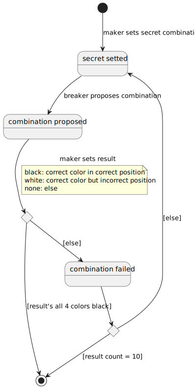

# myGame-mastermind
Project developed during [master of programming and software design](https://escuela.it/masters/master-programacion-diseno-software).

## Índex
* [Branches](#Branches)  
   * [branch-js](#branch-js)
* [domainModel](#domainModel)  
   * [vocabulary](#vocabulary) 
   * [instructions](#instructions)
   * [finalState](#finalState)  
   

## Branches
Game developed whit differents technologies. Each one in his own branch.
### branch-js
Checkout **main-js** branch for game developed with **javascript**.

## domainModel  
  
  

[WIKI](https://es.wikipedia.org/wiki/Mastermind)

[Youtube](https://www.youtube.com/watch?v=2-hTeg2M6GQ)

### vocabulary

  

### instructions 

  
### finalState  
  

