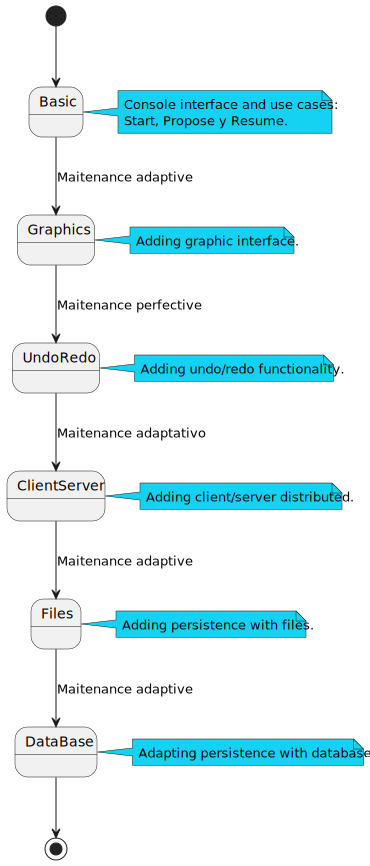
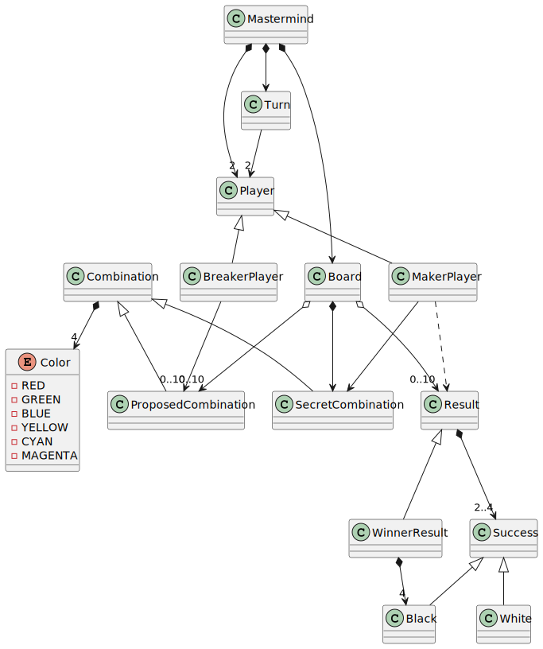
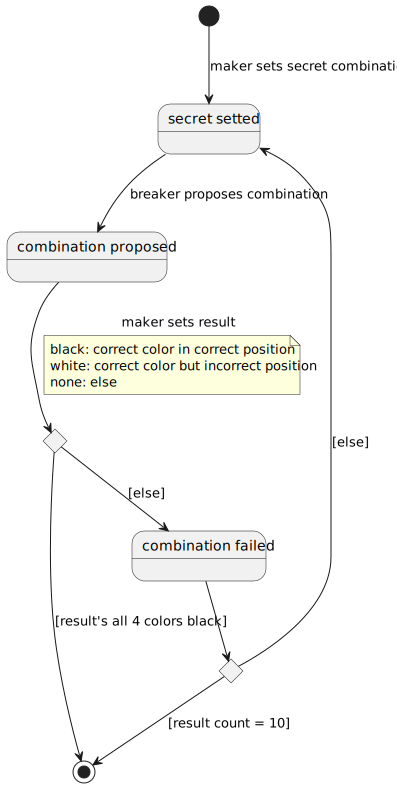
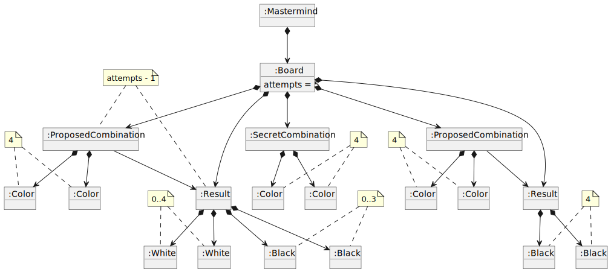

# myGame-mastermind
Project developed during [master of programming and software design](https://escuela.it/masters/master-programacion-diseno-software).

## Índex
* [Main Versions](#main-versions)
   * [Basic](#basic)
* [Develop Process](#develop-process)
* [Domain Model](#domain-model)  
   * [Vocabulary](#vocabulary) 
   * [Instructions](#instructionss)
   * [Final State](#final-state)  
   

## Main Versions

### Basic 
[Basic Requisites](./docs/basic/README.md)

## Develop Process
Checkout the specified branch for each task.

## Domain Model
  
  

[WIKI](https://es.wikipedia.org/wiki/Mastermind)

[Youtube](https://www.youtube.com/watch?v=2-hTeg2M6GQ)

### Vocabulary

  

### Instructions 

  
### Final State  
  

