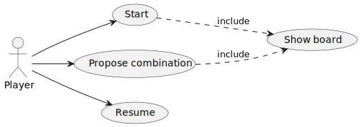
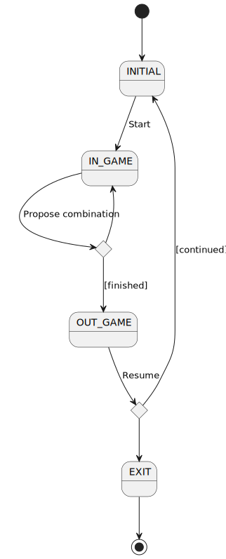
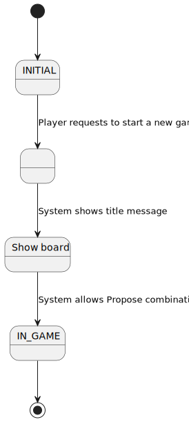
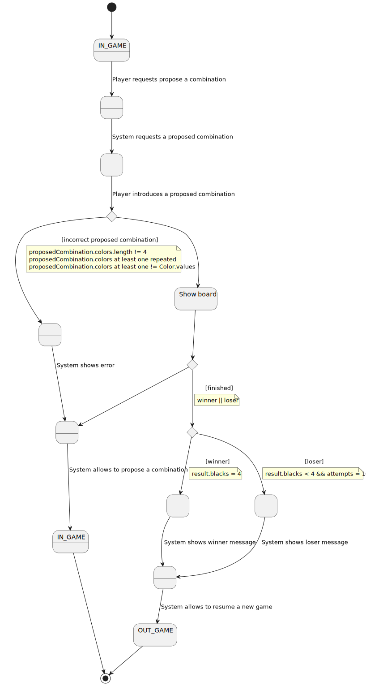
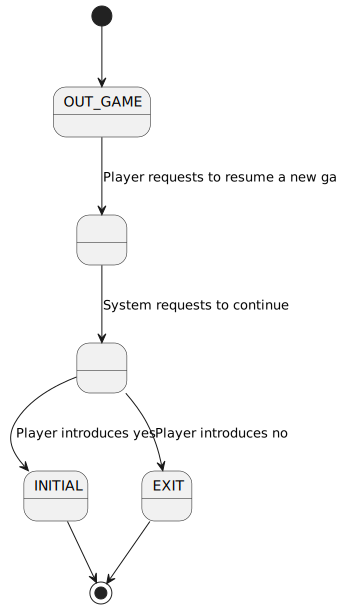

# Mastermind. Basic requisites.
  
**Index**

1. [Requisites](#requisites)  
2. [Use Case View](#use-case-view)  
   2.1. [Start Use Case View](#start-use-case-view)  
   2.2. [Propose Combination Use Case View  ](#propose-combination-use-case-view)  
   2.3. [Resume Use Case View](#resume-use-case-view)  
   2.4. [ShowBoard Included Use Case View](#showboard-included-use-case-view)  
   2.5. [Interface prototype](#interface-prototype)  
      - [Winner Game](#winner-game)  
      - [Looser Game](#looser-game)  

## Requisites  

 * Functionality: **Basic**  
 * Interface: **Console-Text**
 * Distribuction: **Standalone**
 * Persistence: **No**


## Use Case View  

| Actors and Use Case diagram | Context diagram |
|---|---|
|  |  |  

## Start Use Case View
  

## Propose Combination Use Case View  
  

## Resume Use Case View
  

## ShowBoard Included Use Case View
  

### Interface prototype
  
#### Winner Game
```
----- MASTERMIND -----

0 attempt(s): 
****
Propose a combination: rybgmc
Wrong proposed combination length
Propose a combination: rybÑ
Wrong colors, they must be: rgybmc
Propose a combination: rybv
Wrong colors, they must be: rgybmc
Propose a combination: rybc

1 attempt(s): 
****
rybc --> 1 blacks and 3 whites
Propose a combination: rbcy

2 attempt(s): 
****
rybc --> 1 blacks and 3 whites
rbcy --> 1 blacks and 3 whites
Propose a combination: rcyb

3 attempt(s): 
****
rybc --> 1 blacks and 3 whites
rbcy --> 1 blacks and 3 whites
rcyb --> 0 blacks and 4 whites
Propose a combination: yrbc

4 attempt(s): 
****
rybc --> 1 blacks and 3 whites
rbcy --> 1 blacks and 3 whites
rcyb --> 0 blacks and 4 whites
yrbc --> 0 blacks and 4 whites
Propose a combination: bcry

5 attempt(s): 
****
rybc --> 1 blacks and 3 whites
rbcy --> 1 blacks and 3 whites
rcyb --> 0 blacks and 4 whites
yrbc --> 0 blacks and 4 whites
bcry --> 1 blacks and 3 whites
Propose a combination: bycr

6 attempt(s): 
****
rybc --> 1 blacks and 3 whites
rbcy --> 1 blacks and 3 whites
rcyb --> 0 blacks and 4 whites
yrbc --> 0 blacks and 4 whites
bcry --> 1 blacks and 3 whites
bycr --> 4 blacks and 0 whites
You've won!!! ;-)
Do you want to continue? (y/n): 
```

#### Looser Game

```
----- MASTERMIND -----

0 attempt(s): 
****
Propose a combination: rgby

1 attempt(s): 
****
rgby --> 1 blacks and 2 whites
Propose a combination: rgby

2 attempt(s): 
****
rgby --> 1 blacks and 2 whites
rgby --> 1 blacks and 2 whites
Propose a combination: bygr

3 attempt(s): 
****
rgby --> 1 blacks and 2 whites
rgby --> 1 blacks and 2 whites
bygr --> 2 blacks and 1 whites
Propose a combination: rbgy

4 attempt(s): 
****
rgby --> 1 blacks and 2 whites
rgby --> 1 blacks and 2 whites
bygr --> 2 blacks and 1 whites
rbgy --> 2 blacks and 1 whites
Propose a combination: ygbr

5 attempt(s): 
****
rgby --> 1 blacks and 2 whites
rgby --> 1 blacks and 2 whites
bygr --> 2 blacks and 1 whites
rbgy --> 2 blacks and 1 whites
ygbr --> 0 blacks and 3 whites
Propose a combination: grby

6 attempt(s): 
****
rgby --> 1 blacks and 2 whites
rgby --> 1 blacks and 2 whites
bygr --> 2 blacks and 1 whites
rbgy --> 2 blacks and 1 whites
ygbr --> 0 blacks and 3 whites
grby --> 0 blacks and 3 whites
Propose a combination: rgby

7 attempt(s): 
****
rgby --> 1 blacks and 2 whites
rgby --> 1 blacks and 2 whites
bygr --> 2 blacks and 1 whites
rbgy --> 2 blacks and 1 whites
ygbr --> 0 blacks and 3 whites
grby --> 0 blacks and 3 whites
rgby --> 1 blacks and 2 whites
Propose a combination: rgby

8 attempt(s): 
****
rgby --> 1 blacks and 2 whites
rgby --> 1 blacks and 2 whites
bygr --> 2 blacks and 1 whites
rbgy --> 2 blacks and 1 whites
ygbr --> 0 blacks and 3 whites
grby --> 0 blacks and 3 whites
rgby --> 1 blacks and 2 whites
rgby --> 1 blacks and 2 whites
Propose a combination: rgby

9 attempt(s): 
****
rgby --> 1 blacks and 2 whites
rgby --> 1 blacks and 2 whites
bygr --> 2 blacks and 1 whites
rbgy --> 2 blacks and 1 whites
ygbr --> 0 blacks and 3 whites
grby --> 0 blacks and 3 whites
rgby --> 1 blacks and 2 whites
rgby --> 1 blacks and 2 whites
rgby --> 1 blacks and 2 whites
Propose a combination: gbry

10 attempt(s): 
****
rgby --> 1 blacks and 2 whites
rgby --> 1 blacks and 2 whites
bygr --> 2 blacks and 1 whites
rbgy --> 2 blacks and 1 whites
ygbr --> 0 blacks and 3 whites
grby --> 0 blacks and 3 whites
rgby --> 1 blacks and 2 whites
rgby --> 1 blacks and 2 whites
rgby --> 1 blacks and 2 whites
gbry --> 0 blacks and 3 whites
You've lost!!! :-(
Do you want to continue? (y/n): 
```
