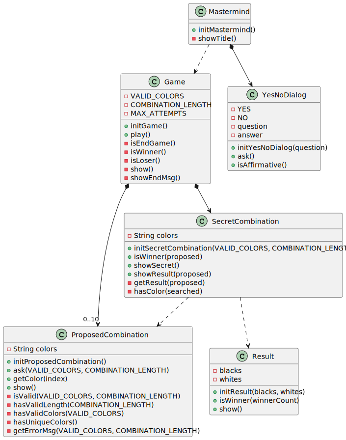

# Analysis

- Mastermind (main class)
    - Responsibility to do (motivation to exist): 
        - allow user play as many games as wanted.
    - Responsibility to know (wich data manage):
        - the game wich is being played
- YesNoDialog
    - Responsibility to do (motivation to exist): 
        - inform if user choices a yes or no  
    - Responsibility to know (wich data manage):
        - the user's choice regarding a question.    
- Game
    - Responsibility to do (motivation to exist): 
        - manage how a game is played      
    - Responsibility to know (wich data manage):
        - game's combinations and rules
- SecretCombination
    - Responsibility to do (motivation to exist): 
        - evaluate a proposed combination
    - Responsibility to know (wich data manage):
        - the secret combination's colors
- ProposedCombination
    - Responsibility to do (motivation to exist): 
        - inform the user's proposed combination
    - Responsibility to know (wich data manage):
        - the user's proposed combination's colors    
- Result
     - Responsibility to do:        
        - inform if the result is a winner one
    - Responsibility to know (wich data manage):
        - number of blacks and whites 

